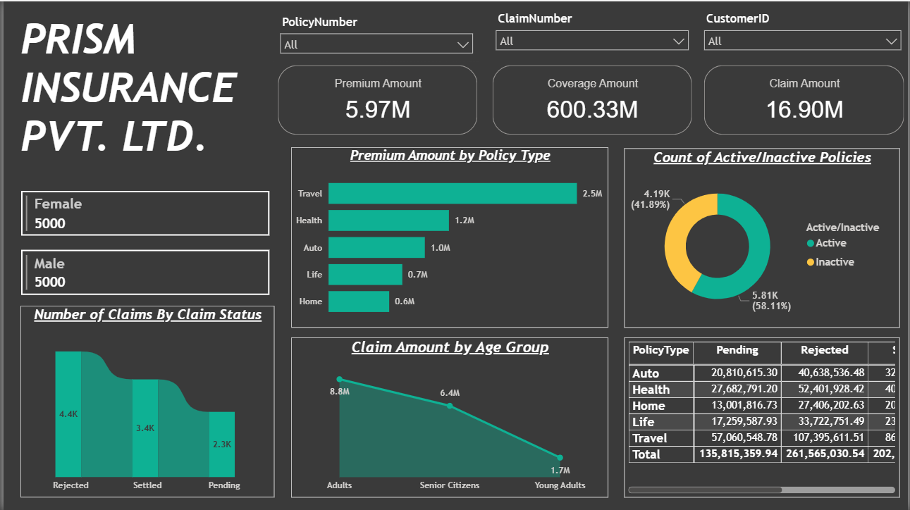
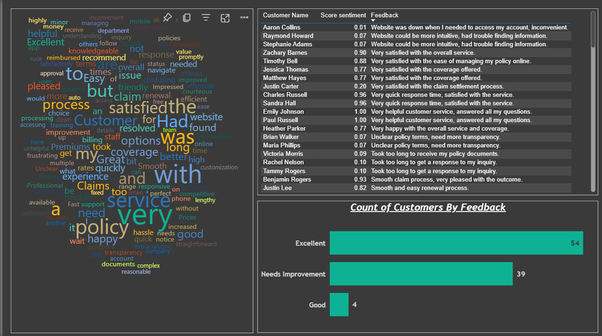

# 🛡️ Insurance Insights: Customer Sentiment & Claims Analytics

## 📊 Project Overview

This repository contains a suite of interactive Power BI dashboards and analytical scripts to uncover trends and actionable insights from insurance customer feedback and claims data. Secure Row-Level Security (RLS) ensures data privacy for all stakeholders.

---

## 🎯 Project Objectives

- Sentiment analysis of insurance customer feedback using NLP.
- Claims analytics: explore patterns across settled, rejected, and pending claims by demographics and policy types.
- Interactive Power BI dashboards with dynamic filters for business exploration.
- SQL-based automated data modeling and ETL.
- Implementation of Row-Level Security (RLS) for data protection.

---

## 🧰 Tools & Technologies

| Tool                | Purpose                                   |
|---------------------|-------------------------------------------|
| Power BI            | Dashboards & RLS                          |
| Excel, CSV          | Source data                               |
| Power Query         | Data cleaning and integration              |
| SQL                 | Data modeling & ETL                       |
| NLP/Text Analysis   | Feedback sentiment extraction             |

---

## 📈 Key Insights

- Uncovered major customer satisfaction themes and areas of concern.
- Visualized claims performance by age, gender, and policy for actionable recommendations.
- Secured analytics access using robust Row-Level Security.

---

## 🏗️ Getting Started

1. Clone this repository to your local machine.
2. Open the provided Power BI files and connect to the datasets (`Insurance-Customer-Feedback.xlsx`, `InsuranceData.csv`).
3. Run the `SQLQuery1.sql` script for your local database setup (optional).
4. Review documentation and dashboards for insights.

---

## 📂 Files Included

- `Insurance-Customer-Feedback.xlsx`: Raw customer feedback.
- `InsuranceData.csv`: Insurance policy and claims transaction data.
- `InsuranceData.sql`: SQL schema and sample queries.

---

## 📸 Dashboard Preview

---
